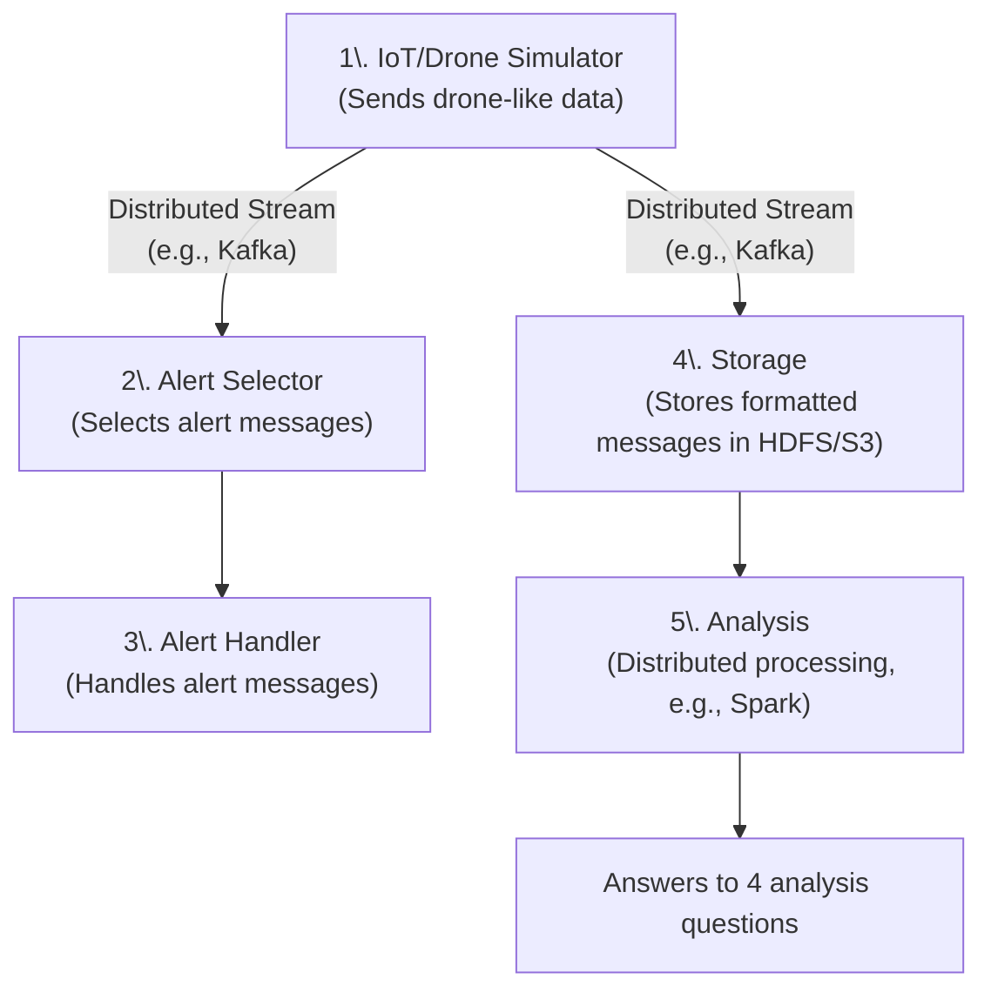

# Data-engineering
POC StockNow dans le cadre du cours d'introduction au data engineering

## Architecture needed for the project

```mermaid
flowchart TD
    A["1\. IoT/Drone Simulator
    (Sends drone-like data)"] -->|"Distributed Stream
    (e.g., Kafka)"| B["2\. Alert Selector
    (Selects alert messages)"]
    A -->|"Distributed Stream\n(e.g., Kafka)"| D["4\. Storage
    (Stores formatted messages in HDFS/S3)"]
    B --> C["3\. Alert Handler
    (Handles alert messages)"]
    D --> E["5\. Analysis
    (Distributed processing, e.g., Spark)"]
    E --> F["Answers to 4 analysis questions"]
```