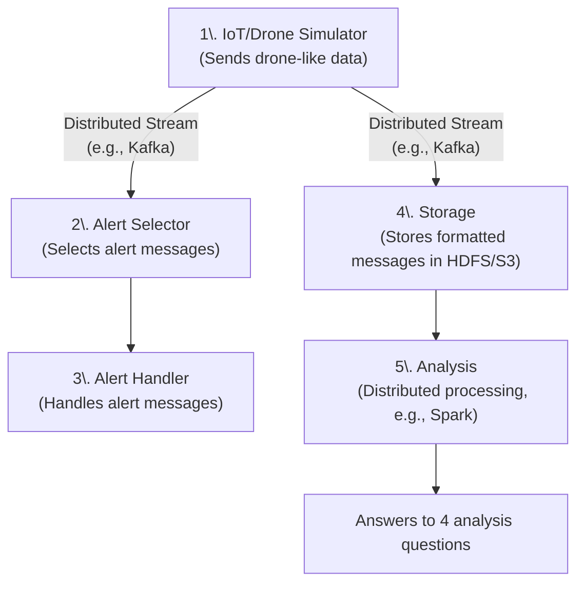

# Data-engineering
POC StockNow dans le cadre du cours d'introduction au data engineering


## Architecture needed for the project




## Architecture Overview

The system consists of 5 main components:

1. **Simulator** (`composant_1_simulateur`) - Generates IoT sensor data
2. **Alert Filter** (`composant_2_alert_filter`) - Filters alert messages from the stream
3. **Alert Handler** (`composant_3_alert_handler`) - Processes and handles alerts
4. **Storage** (`composant_4_storage`) - Stores data in HDFS
5. **Analysis** (`composant_5_analysis`) - Analyzes stored data with Spark

## Infrastructure Components

- **Kafka** - Message streaming platform
- **Zookeeper** - Kafka coordination service
- **HDFS** - Distributed storage (NameNode + DataNode)

## Quick Start

### Prerequisites

- Docker and Docker Compose installed
- At least 4GB RAM available for containers
- Ports 9092, 9870, 9864, 4040 available

### 1. Start the Pipeline

```bash
# Make the script executable
chmod +x docker-run.sh

# Start all services
./docker-run.sh start
```

### 2. Monitor the Pipeline

```bash
# Check service status
./docker-run.sh status

# View logs for all services
./docker-run.sh logs

# View logs for specific service
./docker-run.sh logs simulator
./docker-run.sh logs storage
```

### 3. Run Analysis

After letting the pipeline run for a few minutes to collect data:

It is recommended to run the clean-analysis to have something readable.

```bash
# Run the clean-analysis component
./docker-run.sh clean-analysis
```

```bash
# Run the analysis component
./docker-run.sh analysis
```

### 4. Stop the Pipeline

```bash
# Stop all services
./docker-run.sh stop
```

## Available Commands

| Command | Description |
|---------|-------------|
| `start` | Start all services |
| `stop` | Stop all services |
| `restart` | Restart all services |
| `build` | Build all Docker images |
| `logs [service]` | Show logs |
| `status` | Show service status |
| `clean` | Remove all containers and images |
| `analysis` | Run analysis component |
| `help` | Show help message |

## Service Details

### Infrastructure Services

- **Zookeeper**: `localhost:2181`
- **Kafka**: `localhost:9092`
- **HDFS NameNode**: `localhost:9870` (Web UI)
- **HDFS DataNode**: `localhost:9864` (Web UI)

### Application Services

- **Simulator**: Generates stock sensor data every 5 seconds
- **Alert Filter**: Filters messages with `alert: true`
- **Alert Handler**: Processes alerts and creates missing product reports
- **Storage**: Stores all messages in HDFS with partitioning by date/hour
- **Analysis**: Runs batch analysis on stored data

## Data Flow

```
Simulator → Kafka (instocknow-input) → Alert Filter → Kafka (instocknow-alerts) → Alert Handler
                      ↓
                   Storage → HDFS → Analysis (Spark)
```

## Monitoring

### HDFS Web UI
- **NameNode**: http://localhost:9870
- **DataNode**: http://localhost:9864

### Spark UI (when analysis is running)
- **Spark**: http://localhost:4040

### Kafka Topics
- `instocknow-input`: All sensor messages
- `instocknow-alerts`: Filtered alert messages
- `instocknow-missing-products`: Missing product reports
